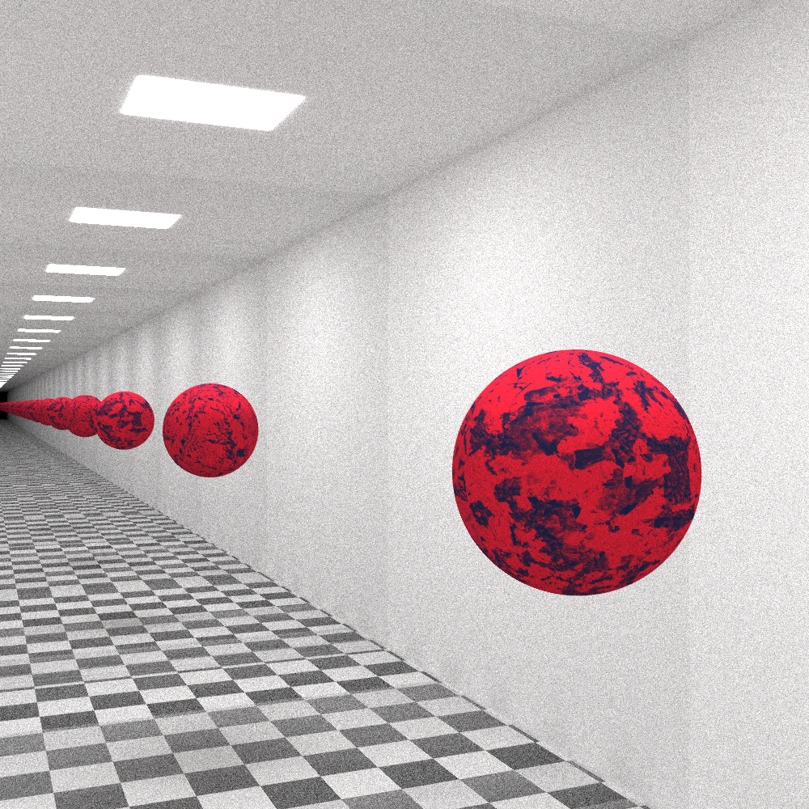
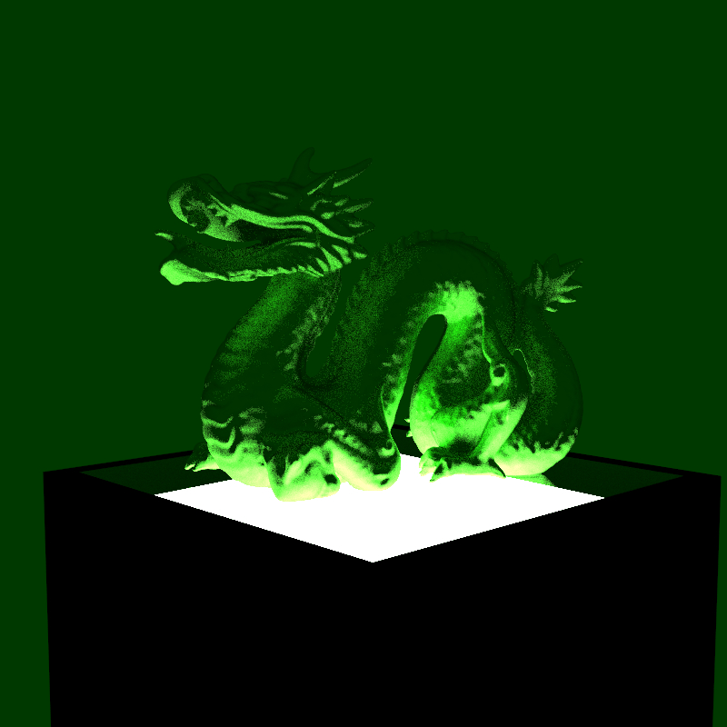
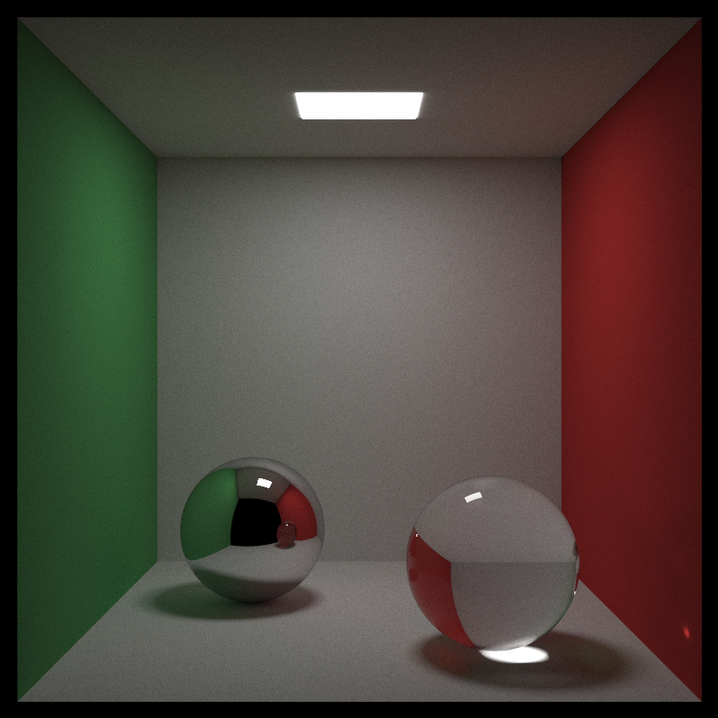
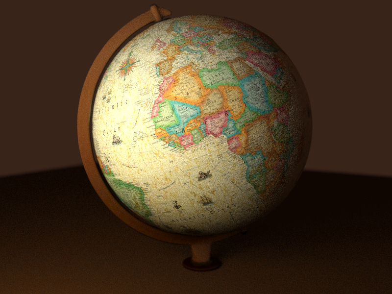

# MyPathTracer


Simple path tracer for Linux based on the [Ray Tracing in One Weekend Book Series](https://raytracing.github.io/), with the addition of:
* **Ray-triangle intersection**
* **3D Model Loading**
* **Parallelism**
* **Personalization of scenes** through an **input .txt file**
* An OpenGL (version 3.3) "**scene explorer**" program

3D model loading, as well as the OpenGL program, are based on the tutorials over at [Learn OpenGL](https://learnopengl.com/).
The scene explorer program's structure was inspired by [BennyQBD's Modern OpenGL Tutorial](https://github.com/BennyQBD/ModernOpenGLTutorial).

This project was developed as an assignment for the 2023-2024 *Computer Graphics* course at **University of Florence**.

## Building

Building requires the following libraries to be installed:
* [SDL2](https://github.com/libsdl-org/SDL)
* [GLEW](https://glew.sourceforge.net/)
* [assimp](https://github.com/assimp/assimp)

```bash
sudo apt-get update
sudo apt-get install libsdl2-dev 
sudo apt-get install libglew-dev
sudo apt-get install libassimp-dev
```

Once the libraries are installed, ***MyPathTracer*** can be built with the **GNU Make** utility (there's a *Makefile* in the *MyPathTracer* directory). Simply open a terminal and type `make` from the *MyPathTracer* directory. 

Building  will result in two binary files, contained in the *bin* directory:
* ***myPT***, the path tracer program
* ***mySceneExp***, the scene explorer program

To delete the binaries, type `make clean` from the *MyPathTracer* directory.

## Usage
The programs need to be run from the *MyPathTracer* directory, typing:
```bash
./bin/myPT
```
or:
```bash
./bin/mySceneExp
```
There's an **input file** in the *MyPathTracer* directory named *ptInput.txt*, which can be used to set the parameters for the two programs. Just write the number/string that you want as a parameter value next to the corresponding parameter name in the input file. (**NOTE**: don't move the parameter names/values in *ptInput.txt* to lines different to the original ones, as the program won't be able to find them. Also be sure to follow the format `[paramater name] : [parameter value]`, spaces included.)

Now follows a more detailed description of the various aspects that need to be kept in mind when using the two programs.

### myPT
The path tracer can render either one of three **hard-coded scenes**, or an **external scene**, that is, an **external 3D model** in the *wavefront .obj* file format (more on 3D models can be found later in this README file). The scene can be specified through the value of the `Scene Number` parameter in the input file *ptInput.txt*:
* `Scene Number : 0` is for external 3D models. You also need to indicate the model's name at `3D Model Name`
* `Scene Number : 1` is for the final scene included in the book [Ray Tracing In One Weekend](https://raytracing.github.io/books/RayTracingInOneWeekend.html)
* `Scene Number : 2` is for a [Cornell Box scene](https://en.wikipedia.org/wiki/Cornell_box), based on the one in [Ray Tracing: The Next Week](https://raytracing.github.io/books/RayTracingTheNextWeek.html)
* `Scene Number : 3` is for a scene based on the Cornell Box, only with mirrors as two of its walls, and a sphere that gets repeatedly reflected in them

These so called `SCENE SETTINGS` of *ptInput.txt* that we just mentioned are followed by `CAMERA SETTINGS`. For the most part, the camera settings parameters are what you would normally expect from a ray tracer. I'll only mention a couple of them:
* `Defocus Angle` regolates the "amount" of *defocus blur* in the image. For example, `Defocus Angle : 0` means no defocus blur.
* `Focus Distance` regolates the distance of the *focus plane* (where things are in focus) from the camera.

All **camera settings** following `Output Image Name` are **ignored** in the case of **hard-coded scenes** (since the camera parameters are hard-coded in the source too).

When run, ***myPT*** creates a folder with the same name as the output image in the *images* directory, where the output image, divided in groups of adjacent rows, is rendered by **multiple threads**. These groups of rows are indicated with the term "**sub-images**", and there can be more (as well as less) sub-images than threads. Each thread, independently from the others, renders a sub-image, until there aren't any left to render. The **number of threads** and **sub-images** to use can be specified in the `SYSTEM SETTINGS` of the **input file**.

It's worth mentioning that the number of rows `n` in each sub-image is calculated as:

`n =  h / s`

where `h` is the height of the image (in pixels) and `s` is the number of sub-images. 
For the last sub-image (the one with the bottom rows of the full image) the number of rows is actually:

`n + h % s`

to account for the remaining rows.
(**NOTE**: these remaining rows could cause the last sub-image to be much larger than the others, making its rendering a time-bottleneck for the program. To have better performance, be sure that `h` is a multiple of `s`.)

Once all of the sub-images have been rendered, the full image is put together and saved in the *images* directory. The **image format** is **PPM**.

### mySceneExp
The so-called "scene explorer" was thought as a tool for:
* Verifying that 3D models are loaded correctly (since its model-loading logic is very similar to the path tracer's)
* Verifying that (some) camera parameters have appropriate values, and **positioning the camera**

Here's how it should be used:
* Once the program is run, it creates an **SDL2 window** with an **OpenGL context**, using parameters from *ptInput.txt*.
The window uses `Output Image Name` as its name, and`Aspect Ratio` as its aspect ratio.
OpenGL renders the 3D model whose name is specified at `3D Model Name`, where **every material type** different from lambertian is assigned a **specific**, hard-coded **color** (e.g. all metal materials are shown as grey). The scene's background is determined by `Background Color`.
The scene's camera gets the following parameters from the input file:
  * `Vertical Field of View` 
  * `"Look-From" Vector` (as the camera's starting position)
* You can **move around** the scene with your mouse and *WASD* keys, plus *SPACEBAR* and *E* to move up/down
* You can make the **focus plane** visible by typing *F*, and set its distance with the *UP/DOWN* arrow keys
* This way, you can choose a camera angle and a focus plane distance that you like. Once you have done so, if you press *ENTER*, ***mySceneExp*** will close the window and **write** the corresponding **camera parameters** in ***ptInput.txt***, ready to be used by ***myPT***. If you press *ESC*, the window will close without writing the parameters.


### 3D Models
External 3D models need to use the *wavefront .obj* format, alongside a *.mtl* file for the materials, both with the same name (e.g: *mymodel.obj*, *mymodel.mtl*) ([Wavefront OBJ file format guide](https://computergraphicsguide.blogspot.com/2015/08/wavefront-obj-file-format-and-normal.html)). The two files need to be saved in a directory inside *models*, also with the same name (e.g: *mymodel*). The name then needs to be specified in the *3D Model Name* parameter of the input file (e.g: `3D Model Name : mymodel`).

There are various examples already present in *models*, which have been put together in Blender using the following resources:
* [A Stanford Bunny model](https://sketchfab.com/3d-models/glass-bunny-caeb681795a54c6eb0bf120582fe7f45), by Zachary Ferguson on Sketchfab ([license](https://creativecommons.org/licenses/by-sa/4.0/))
* [A Stanford Dragon model](https://sketchfab.com/3d-models/stanford-dragon-sss-test-d6b85e8dc4b54269b3df6c7e1e5541ba), by Maurice Svay on Sketchfab ([license](https://creativecommons.org/licenses/by/4.0/))
* [A low poly forest model](https://sketchfab.com/3d-models/low-poly-forest-1-e7bb0600ee7c47a9aadf5598861837aa), by POLYSCAN on Sketchfab
* [A globe model](https://sketchfab.com/3d-models/globe-f219f29dbd7f4b28be84c92e5c9507e6), by Lassi Kaukonen on Sketchfab ([license](https://creativecommons.org/licenses/by/4.0/))
* [A low poly origami penguin model](https://sketchfab.com/3d-models/lowpoly-origami-penguin-23627a7c3c6f4b8abf092aa505b14326), by assetfactory on Sketchfab

### Material Conventions
The *.mtl* files are expected to follow various conventions, loosely based on the MTL File Format Documentation ([here](https://docs.fileformat.com/3d/mtl/), [here](https://www.loc.gov/preservation/digital/formats/fdd/fdd000508.shtml) and [here](https://paulbourke.net/dataformats/mtl/)) .
Here's how the parameters are interpreted:
* `Ns` represents the **shininess** (from 0 to 1000)
* `Kd` represents the **diffuse color**
* `Ks` represents the **specular color**
* `Ke` represents the **emissive color**
* `Ni` represents the **index of refraction**
* `illum` represents the **illumination model** 
* `map_Kd` is the **texture image file** for **lambertian materials**

The path tracer works with the following types of materials:
* **Lambertian**, which can be specified in the *.mtl* file with:
  * `illum 2` (*base shading*) as the illumination model
  * `Kd` as the color, or
  * `map_Kd` as the texture (in this case, `Kd` is ignored) (**NOTE**: if `Ke` is different from zero, the material will be treated as a **diffuse light**)
* **Metal**, which can be specified with:
  * `illum 3` (*reflection on*) as the illumination model
  * `Ks` as the color
  * `Ns` as the inverse of the *fuzziness*. For example, `Ns 1000` means clear, mirror-like reflections on material surface, while `Ns 0` means maximum fuzziness
* **Dielectric**, which can be specified with:
  * `illum 6` (*refraction on*) as the illumination model
  * `Ni` as the index of refraction of the material
* **Diffuse Light**, which can be specified with:
  * `illum 2` (*base shading*) as the illumination model
  * `Ke` as the color of the emitted light (must be non-zero)

## Gallery

     
